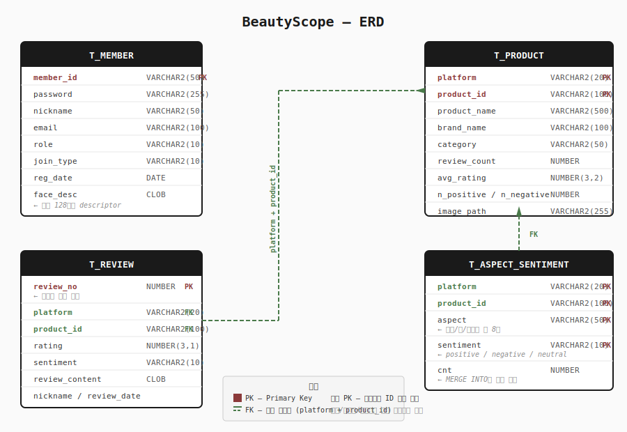

# BeautyScope

> 화장품 리뷰 53만 건을 분석해서 상품별 장단점을 한눈에 보여주는 웹 서비스

별점 4.9인 제품인데 "트러블/자극" 항목 긍정률이 33%인 경우가 실제로 있습니다.
별점만 보면 절대 알 수 없고, 리뷰를 직접 읽기엔 너무 많습니다.
→ 리뷰 53만 건을 분석해서 속성별 장단점을 한눈에 보여줍니다.

---

## 데이터

| 플랫폼 | 건수 |
|---|---|
| 쿠팡 (직접 크롤링) | 86,379건 |
| 무신사 (팀원 제공) | 230,870건 |
| 올리브영 (팀원 제공) | 221,525건 |
| **합계** | **538,774건** |

원래는 Python(pandas, scikit-learn)으로 감성분석 결과를 Streamlit으로 보여주는 프로젝트였는데,
학교 과제 형식에 맞춰 Spring MVC + MyBatis + Oracle + JSP로 다시 짰습니다.
그 과정에서 회원가입/로그인, 관리자 페이지, 소셜 로그인, 얼굴 인식 로그인까지 하나씩 붙여나갔습니다.

---

## 기술 스택

- **백엔드**: Java 17, Spring MVC 6 (XML 설정), MyBatis
- **DB**: Oracle XE (hr/hr@XEPDB1)
- **프론트**: JSP, JSTL, Chart.js (로컬), face-api.js (로컬)
- **빌드**: Maven / Apache Tomcat
- **인증**: 세션 직접 구현 (Spring Security 미사용), 카카오/네이버 OAuth2, face-api.js 얼굴 인식
- **보안**: BCrypt 비밀번호 해싱

---

## 주요 기능

### 일반 유저

| 기능 | URL | 설명 |
|---|---|---|
| 메인 | `/` | TOP5 상품, 카테고리 바로가기, 전체 통계 |
| 상품 목록 | `/product` | 카테고리 필터, 정렬(평점/리뷰수), 페이징 |
| 상품 상세 | `/product/{platform}/{id}` | 장단점 분석, 별점 분포 차트, 리뷰 검색 |
| 상품 검색 | `/product/search` | 상품명 + 브랜드명 통합 검색 |
| 랭킹 | `/ranking` | 카테고리별 Top10, 브랜드 비교 차트 |
| AI 추천 | `/recommend` | 속성 선택 → 맞춤 상품 추천 (베이지안 보정) |
| 리뷰 작성 | 상품 상세 페이지 | 로그인 회원이 직접 작성 → 장단점에 즉시 반영 |
| 회원가입 | `/signup` | 아이디/비밀번호/닉네임, BCrypt 해싱 |
| 로그인 | `/login` | 일반 / 카카오 / 네이버 / 얼굴 인식 |
| 아이디·비번 찾기 | `/find` | 이메일로 아이디 확인, 임시 비밀번호 발급 |
| 마이페이지 | `/mypage` | 프로필 수정, 비밀번호 변경, 얼굴 등록, 회원 탈퇴 |

### 관리자 (ADMIN 권한 전용)

| 기능 | URL | 설명 |
|---|---|---|
| 회원 관리 | `/admin/members` | 목록 조회, 키워드 검색, 권한 변경, 회원 삭제 |
| 상품 관리 | `/admin/products` | 상품 추가, 수정, 삭제 |
| 리뷰 관리 | `/admin/products/{id}/reviews` | 리뷰 수동 추가, 삭제 |

`AdminInterceptor`가 `/admin/**` 경로를 가로채서 ADMIN 권한 없으면 메인으로 리다이렉트합니다.

---

## DB 스키마 (ERD)



- **T_PRODUCT** — 상품 정보. `(platform, product_id)` 복합 PK.
  쿠팡/무신사/올리브영이 각자 번호 체계를 쓰기 때문에 platform을 PK에 포함합니다.
- **T_REVIEW** — 리뷰 538,774건 + 유저 작성 리뷰. `review_no` 시퀀스 PK.
  `(platform, product_id)` 인덱스로 상세 페이지 로딩 속도 확보.
- **T_ASPECT_SENTIMENT** — 상품×속성별 감성 집계. `(platform, product_id, aspect, sentiment)` 복합 PK.
  Oracle MERGE INTO로 리뷰 추가 시 cnt를 누적합니다.
- **T_MEMBER** — 회원 정보. 비밀번호는 BCrypt 해시, 얼굴 128차원 descriptor는 CLOB으로 저장.
  상품/리뷰와 직접 FK는 없습니다.

---

## 속성 분석 로직

### 크롤링 데이터 → 속성 집계

Python에서 Okt 형태소분석기로 리뷰 본문을 분석하고, 8개 속성 키워드 매칭으로 감성을 분류한 결과를 `T_ASPECT_SENTIMENT`에 적재했습니다.
신뢰도 낮은 리뷰 50,806건(9.5%)은 ML 모델로 걸러낸 뒤 집계에서 제외했습니다.

### 유저 리뷰 → 속성 즉시 반영

로그인 회원이 직접 리뷰를 작성하면 같은 크롤링 데이터 집계 방식으로 속성 분석이 실행되어 장단점 표시에 즉시 반영됩니다.

1. 상품 상세 페이지에서 평점(1~5)과 리뷰 내용 입력 후 등록 (`POST /api/reviews`)
2. 평점 기준으로 감성 자동 결정: 4~5점 → positive, 3점 → neutral, 1~2점 → negative
3. `T_REVIEW` INSERT 후 `AspectAnalyzer.analyze(본문, sentiment)` 실행
   - 문장을 절 단위로 쪼갠 뒤 8개 속성 키워드와 매칭
   - 부정어("안 ", "않", "별로" 등)가 앞에 붙으면 감성 반전
   - 매칭된 (속성, 감성) 쌍마다 `T_ASPECT_SENTIMENT.cnt += 1` (Oracle MERGE INTO)
4. 상품 상세의 "장점/단점" 섹션 원본이 이 테이블이라 즉시 반영됩니다
5. `T_PRODUCT`의 평균 평점·리뷰 수도 자동 재계산

관리자가 수동 추가하거나 CSV로 일괄 업로드한 리뷰에도 동일하게 적용됩니다.

### 8개 속성과 키워드

| 속성 | 키워드 |
|---|---|
| 보습/수분 | 보습, 수분, 촉촉, 건조함, 당김, 속건조 |
| 향 | 향이, 향도, 냄새, 스멜, 체취 |
| 트러블/자극 | 트러블, 자극, 뒤집, 여드름, 따갑, 가렵, 붉어짐 |
| 발림성/흡수력 | 발림, 흡수, 끈적, 산뜻, 가볍게, 무겁게 |
| 지속력 | 지속력, 오래가, 유지력 |
| 가격/가성비 | 가성비, 가격이, 비싸, 저렴, 가격대비 |
| 용기/디자인 | 용기가, 펌프, 디자인, 튜브, 패키지 |
| 효과 | 효과, 좋아졌, 개선, 변화가, 효과가 |

---

## AI 추천 로직

이름은 "AI 추천"이지만 학습된 모델은 아닙니다. 분석 결과에 공식을 적용해 점수를 매깁니다.

```
점수 = 선택한 속성의 만족도(50%) + 전체 리뷰 만족도(30%) + 평점(20%)
```

리뷰가 5개뿐인 제품이 우연히 다 긍정이라고 1위로 올라가는 걸 막기 위해
**베이지안 평균**으로 보정합니다. 리뷰가 적으면 점수를 카테고리 평균 쪽으로 끌어당깁니다.

가중치 50/30/20은 임의로 정한 값입니다. 화장품 리뷰는 평점이 대부분 4~5점에 몰려있어서
회귀로 가중치를 학습시켜도 신뢰할 만한 결과가 나오기 어렵다고 판단했습니다.

---

## 얼굴 인식 로그인

face-api.js(TensorFlow.js 기반)를 사용합니다. 모델 가중치 파일 7개를 서버
`resources/face-weights/`에 직접 올려두어 인터넷 없이도 동작합니다.

### 등록 (`face/register.jsp` → `POST /face/register`)

1. 마이페이지 → "얼굴 등록" 버튼 클릭
2. 웹캠 영상에서 TinyFaceDetector로 얼굴 위치를 찾고, faceRecognitionNet으로 128차원 descriptor 추출
3. 쉼표로 이어 붙인 문자열로 `T_MEMBER.face_desc`(CLOB)에 저장

### 로그인 (`face/login.jsp` → `POST /login/face`)

1. 버튼을 누르면 200ms 간격으로 8프레임 descriptor를 수집 (`SAMPLE_COUNT = 8`)
2. **라이브니스 검증**: 8프레임 간 분산값이 0.0003 미만이면 정지된 사진으로 판단해 차단
   실제 얼굴은 미세한 움직임으로 분산이 이 값보다 높습니다
3. 8프레임 평균 descriptor를 서버로 전송
4. `MemberServiceImpl.loginWithFace`에서 DB의 등록된 얼굴 전체와 유클리드 거리 계산,
   가장 가까운 회원을 찾습니다
5. 거리 < **0.4** (`FACE_MATCH_THRESHOLD`)이면 로그인 성공, 이상이면 실패

데모 수준이고 진짜 보안 인증으로 쓸 정확도는 아닙니다. 조명·각도에 민감합니다.

---

## 폴더 구조

```
kr.ac.kopo
├── product     상품 목록/검색/상세/랭킹
├── review      리뷰 조회, 관리자 리뷰 등록
├── aspect      속성 분석 + AI 추천
├── member      회원가입/로그인/얼굴인식/소셜로그인
├── admin       관리자 페이지
└── common      공통 인터셉터, 예외 처리
```

---

## 실행 방법

1. `sql/` 폴더 안의 스키마 파일들을 Oracle에 순서대로 실행
   (`beautyscope_schema.sql` → `member_schema.sql` → `member_face_schema.sql` → `aspect_schema.sql`)
2. `src/main/resources/config/spring/spring-mvc.xml`에서 DB 접속 정보 수정
3. 소셜 로그인 사용 시 `oauth.properties.example`을 `oauth.properties`로 복사해서
   카카오/네이버 키 입력 (이 파일은 git에 포함되지 않습니다)
4. `mvn clean package` 빌드 후 Tomcat에 배포

---

## 한계

| 항목 | 내용 |
|---|---|
| AI 추천 | 학습된 모델이 아니라 가중 합성 점수 공식입니다 |
| 얼굴 인식 | 데모 수준. 조명·각도에 민감하고 보안 인증용 정확도는 아닙니다 |
| 비밀번호 찾기 | 이메일 발송 없이 화면에 임시 비밀번호를 직접 표시합니다 (데모 환경) |
| 상품 이미지 | 2,393개 중 약 1%는 크롤링 당시 페이지가 없거나 검색에서 못 찾아 누락됩니다 |
| 상품 이미지 파일 | 800MB 이상이라 이 저장소에는 포함되지 않습니다 |
| 모바일 반응형 | CSS 미디어쿼리 작업까지는 하지 않았습니다 |

---

## 데이터 출처

쿠팡/무신사/올리브영을 Python으로 크롤링해서 리뷰 538,774건, 상품 2,393개를 모았습니다.
쿠팡은 봇 차단이 있어 네이버 쇼핑 검색으로 같은 상품명을 검색해 대표 이미지를 가져왔습니다.
(가끔 진짜 그 상품이 아닌 비슷한 제품 사진이 붙는 경우가 있습니다)

---

학습/포트폴리오용으로 만든 프로젝트입니다.
